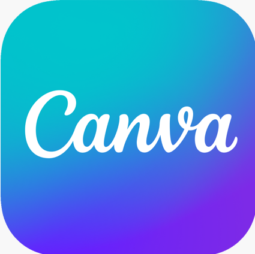

#  Hi, I'm Carolyn

<!-- Contact information row here -->

### Hey there!

#### (*...or* Salut / 哈囉 / Привет 😊) 

### I'm a self-taught programmer, a high school student (for now), and I love pretty much anything to do with STEM and problem-solving.
📚 I enjoy **learning new things, helping others, coding** (obviously), and occasionally **playing around with designs** (like my profile picture and header). Aside from programming, I also have experience in robotics, as well as 2D and 3D design.

💬 *Some more interests of mine: music, languages, figure skating*

## 💻 Tech & Skill Stack

<code></code>
<code></code>
<code></code>
<code></code>
<code></code>
<code></code>
<code></code>
<code></code>
<code></code>
<code></code>
<code></code>
<code></code>
<code></code>

## 🌱 What I'm learning

...and more!

## 💼🔭 Projects & Plans

  
What I'm up to 👀

#### [🎓 QUÉtudes-info: Guide to CEGEP](https://github.com/cw118/quetudesinfo) — my first website and large-scale coding project
*Don't know what a CEGEP is?* [Visit the site to find out 😊](https://cw118.github.io/quetudesinfo/)
- Responsive website made with `HTML, CSS, and JavaScript`, hosted by 
- Independently completed all research, design and code
- Site updates continue as colleges post new information

#### 👩‍💻 Personal website (in-progress) — my first React app
- Now learning `React`, `Netlify`, some `Node` and possibly `Sass` to develop my personal site
- Trying out wireframing and prototyping with `Figma`

#### 📌 Hackathons, workshops, mini-projects...
- Working on my portfolio and fun side projects
- Contributing to the coding community — getting involved in open source
  - I've recently been helping out with **MDN Web Docs** (both [English content](https://github.com/mdn/content) and [translated content](https://github.com/mdn/translated-content))
- Picking up new skills, mastering what I know and training my problem-solving/computational logic (have a look at some of my [repositories](https://github.com/cw118?tab=repositories)!)

