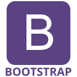

# <a href="https://www.carolynwu.me"> Hi, I'm Carolyn</a>

### I'm a self-taught programmer who loves learning and problem-solving.

## 💻 Tech stack

<code></code>
<code></code>
<code></code>
<code></code>
<code></code>
<code></code>
<code></code>
<code></code>
<code></code>
<code></code>
<code></code>
<code></code>
<code></code>
<code></code>
<code></code>
<code></code>
<code></code>
<code></code>
<code></code>
<code></code>
<code></code>
<code></code>
<code></code>

  
<em><strong>My stats:</strong></em>
 
  
  

  
  

## 💼🔭 Projects and plans

  
What I'm up to 👀

#### 📌 Open source, workshops, hackathons and challenges

- Contributing to the coding community — getting involved in open source
  - I've recently been helping out with **MDN Web Docs** (I'm a maintainer/reviewer for `l10n-fr` at [translated-content](https://github.com/mdn/translated-content), I also contribute to [English content](https://github.com/mdn/content) and more)
- Working on my portfolio and fun side projects
- Picking up new skills, mastering what I know and training my problem-solving (have a look at some of my [repositories](https://github.com/cw118?tab=repositories))

